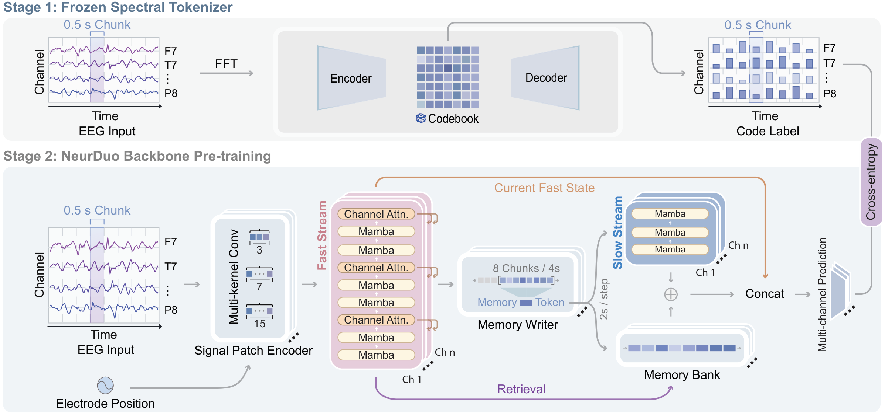

<div align="center">

# NeurDuo-EEG

_A Long-Sequence EEG Foundation Model with Persistent State and Explicit Memory_


</div>

<p align="center">
    🔍&nbsp;<a href="#-about">About</a>
    | 📦&nbsp;<a href="#-model-zoo">Model Zoo</a>
    | 🔨&nbsp;<a href="#-setup">Setup</a>
    | 🚢&nbsp;<a href="#-pretrain">Pretrain</a>
    | ⛵&nbsp;<a href="#-finetune">Finetune</a>
    | 🚀&nbsp;<a href="#-quick-start">Quick Start</a>
    | 🔗&nbsp;<a href="#-citation">Citation</a>
</p>

## 🔍 About

Official implementation of **NeurDuo-EEG: A Long-Sequence EEG Foundation Model with
Persistent State and Explicit Memory**.

<div align="center">

</div>

### Abstract

Electroencephalography (EEG) is recorded continuously over hours, with relevant dynamics spanning timescales from milliseconds to hours. Most EEG foundation models nevertheless process fixed windows independently, limiting their ability to capture information encoded in long-timescale dynamics. State-space architectures enable persistent recurrent processing, but long-range information remains implicitly compressed in recurrent states. We present NeurDuo-EEG, a causal EEG foundation model with channel-resolved persistent memory. NeurDuo-EEG introduces multi-timescale memory management with learned consolidation and selective retrieval, enabling persistent modelling of continuous EEG with fixed-size state. It is pre-trained on 3,955 hours of EEG from 17 public datasets using multi-channel autoregressive prediction of discrete spectral codes. Across three short-window and two long-sequence downstream tasks, NeurDuo-EEG achieves the best performance on four of five benchmarks, including all three short-window tasks and seizure detection, where AUC-PR improves from 0.285 to 0.471 over the strongest non-NeurDuo baseline. Notably, NeurDuo-EEG supports efficient streaming inference with near-constant per-chunk latency as the available history extends to 1h. NeurDuo-EEG-Small achieves this with only 4.7M backbone parameters. At the same time, it demonstrates strong competitiveness in sleep staging tasks. These results show that our model effectively leverages long-range context in continuous EEG while achieving superior performance on short-window tasks.

## 📦 Model Zoo

The sizes differ in the frontend width H and in the width and depth of the fast
(d_f, L_f) and slow (d_s, L_s) streams.

| Model | H | d_f | L_f | d_s | L_s | Parameters | Configuration | Weights |
| --- | --- | --- | --- | --- | --- | --- | --- | --- |
| NeurDuo-Small | 128 | 256 | 6 | 192 | 3 | 4.70M | [`small.json`](configs/pretrain/small.json) | coming soon |
| NeurDuo-Base | 192 | 480 | 10 | 320 | 5 | 24.31M | [`base.json`](configs/pretrain/base.json) | coming soon |
| NeurDuo-Large | 256 | 672 | 15 | 448 | 7 | 67.83M | [`large.json`](configs/pretrain/large.json) | coming soon |
| Spectral tokenizer | | | | | | 0.33M | [`tokenizer.json`](configs/tokenizer.json) | coming soon |

## 🔨 Setup

The Mamba kernels need an NVIDIA GPU, and installing them needs a CUDA 12 toolkit with
`nvcc` on the `PATH`. The code was tested with this environment:

```bash
conda create -n neurduo python=3.10 -y
conda activate neurduo
pip install torch==2.4.1 --index-url https://download.pytorch.org/whl/cu121
pip install causal-conv1d==1.4.0 mamba-ssm==2.2.2 --no-build-isolation
pip install -e .
```

## 🚢 Pretrain

### 1. Prepare pre-training data

Band-pass filter each recording to 0.5–75 Hz, apply a notch filter, resample it to
256 Hz and save it as a float32 `.npy` array of shape `[C, T]`. List the recordings
in a training and a validation JSONL manifest, one recording per line:

```json
{"signal_path": "/path/to/recording.npy", "num_samples": 16384, "channel_positions": [[-0.33, 0.94, -0.08], [0.33, 0.94, -0.08]], "reference_ids": [0, 0]}
```

`channel_positions` and `reference_ids` follow the channel order of the array and
come from [`eeg_fm/electrodes.py`](eeg_fm/electrodes.py): `map_channels` keeps the
channels that have a `standard_1005` position, `coord_of` returns that position and
`reference_id` the reference ID.

### 2. Train the tokenizer

The settings are in [`configs/tokenizer.json`](configs/tokenizer.json).

```bash
NPROC_PER_NODE=4 bash scripts/tokenizer/train_tokenizer.sh \
    --manifest /path/to/train.jsonl --val_manifest /path/to/val.jsonl \
    --output_dir outputs/tokenizer
```

### 3. Pre-train NeurDuo

Select the size with `CONFIG=configs/pretrain/{small,base,large}.json` (default:
small). `batch_size` is per GPU; for several nodes, set `NNODES`, `MASTER_ADDR` and
`MASTER_PORT` and run the command on every node.

```bash
NPROC_PER_NODE=4 bash scripts/pretrain/pretrain.sh \
    --manifest /path/to/train.jsonl --val_manifest /path/to/val.jsonl \
    --tokenizer_ckpt outputs/tokenizer/checkpoints/best.pt \
    --output_dir outputs/pretrain_small
```

## ⛵ Finetune

### Paper datasets

`--dataset` is one of the tasks defined in
[`dataset_specs.py`](eeg_fm/finetune/dataset_specs.py).

```bash
python scripts/finetune/run_finetune.py --dataset faced --seed 0 \
    --data_dir /path/to/faced --checkpoint outputs/pretrain_small/checkpoints/best.pt
python scripts/finetune/aggregate.py --dataset faced
```

### Your own dataset

Add an entry to `DATASET_SPECS` in [`dataset_specs.py`](eeg_fm/finetune/dataset_specs.py),
save `{train,val,test}_X.npy` (`[N, C, T]` at `base_fs`) and `{train,val,test}_y.npy`
in one directory, and pass the new name to `--dataset`:

```python
DATASET_SPECS['my_task'] = dict(
    base_fs=250, seg_sec=4, task='multiclass', n_outputs=4, label_dtype='long',
    channels=['Fp1', 'Fp2', 'C3', 'C4', 'O1', 'O2'], readout_budget=19200,
)
```

```bash
python scripts/finetune/run_finetune.py --dataset my_task --data_dir /path/to/my_task \
    --checkpoint outputs/pretrain_small/checkpoints/best.pt
```

List `channels` in the order of the arrays with standard electrode names; the model
identifies channels by electrode position. `seg_sec` must be a multiple of 0.5 s. For
`task='binary'` or `'regression'`, use `n_outputs=1` and `label_dtype='float'`.

## 🚀 Quick Start

Use the pretrained backbone with your own head. The input is EEG at 256 Hz, cut into
0.5 s chunks and normalized per window:

```python
import torch
from eeg_fm import EEGFM, EEGMetadataBatch
from eeg_fm.data import normalize_window
from eeg_fm.electrodes import coord_of, strip_reference
from eeg_fm.finetune.heads import STHead
from eeg_fm.finetune.net_eegfm import load_model_config

device = torch.device("cuda")
checkpoint = "outputs/pretrain_small/checkpoints/best.pt"
model = EEGFM(load_model_config(checkpoint))
model.load_state_dict(torch.load(checkpoint, map_location="cpu", weights_only=False)["student"])
model.to(device).eval()

channels = ["Fp1", "Fp2", "C3", "C4", "O1", "O2"]
eeg = torch.randn(len(channels), 10 * 256)
chunks = normalize_window(eeg.unfold(-1, 128, 128).transpose(0, 1)).unsqueeze(0).to(device)
metadata = EEGMetadataBatch(
    channel_positions=torch.tensor([[coord_of(strip_reference(c)[0]) for c in channels]], device=device),
    reference_ids=torch.zeros(1, len(channels), dtype=torch.long, device=device),
    missing_mask=torch.zeros(1, len(channels), device=device),
)

states = model(chunks, metadata)
head = STHead(n_tokens=states.shape[0] * states.shape[1], d_model=states.shape[2], n_outputs=4).to(device)
logits = head(states.reshape(1, -1, states.shape[2]))
```

`states` holds one fused state per channel and chunk (`[6, 20, 448]` here), and
`logits` is `[1, 4]`.

## 🤝 Acknowledgements

Parts of the fine-tuning code are adapted from [CBraMod](https://github.com/wjq-learning/CBraMod)
(MIT License, see [`LICENSE-THIRD-PARTY`](LICENSE-THIRD-PARTY)).

## 🔗 Citation

If you find our paper or code useful, please consider citing our work:

```bibtex
```
